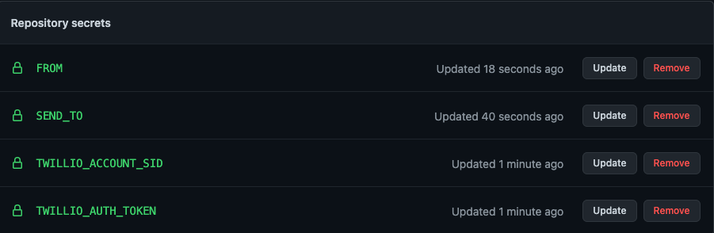
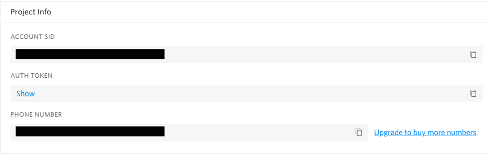

<h1 align="center">Covid Vaccine availability notifier</h1>

<p align="center">
  
</p>

## Setup

* Fork this repo
* Update the config at *src/config.js*

```js
module.exports = {
  // options in the array form a "or" condition while filtering
  minAge: [45, 18],
  pincode: "560008",
  vaccines: ['COVISHIELD', 'COVAXIN', 'SPUTNIK V']
}
```
* Push the updated config
* Create a free twilio account, they have a generous 15 USD credit which you can use for sending sms
* Create following GitHub secrets in your repository, you can read more about it [here](https://docs.github.com/en/actions/reference/encrypted-secrets)



* You can find the *TWILIO_ACCOUNT_SID*, *TWILIO_AUTH_TOKEN*, *FROM* in the twilio dashboard



* *FROM* is a comma separated list of numbers you wish to send sms to, eg: 9533234554,9533234552

## Caveats

* Since the Cowin api is geofenced and we cannot control the region of GitHub action we use the tor network, 
I have hardcoded a exit node in the action file as some of the exit nodes are from digital ocean and Cowin blocks their servers also. 
If the hardcoded exit node goes away just find a new india exit node ip from https://www.bigdatacloud.com/insights/tor-exit-nodes and replace it.
* We have cron job every 5m but GitHub does not promise to follow it strictly so the action might execute every 15m to 30m based on GitHub server loads.
* The actions might fail for few times in the start and then will get stablized.

```yml
- name: Install Tor
  run: |
    sudo apt-get -y install tor
    sudo sh -c "echo 'ExitNodes 216.10.247.146' >> /etc/tor/torrc"
    sudo /etc/init.d/tor restart
```

Show your support by :star: the repo

## License

MIT © [Ameer Jhan](mailto:ameerjhanprof@gmail.com)
